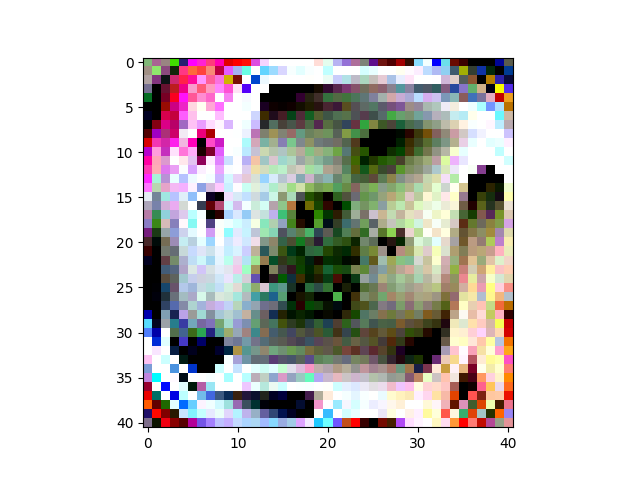
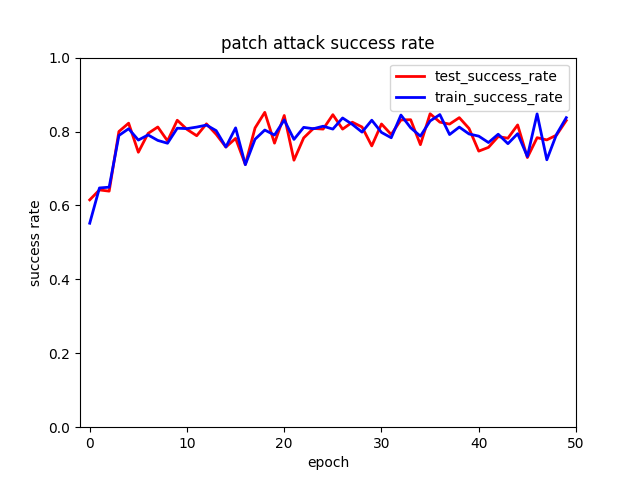

We generate the square patch on 2000 randomly selected pictures with 50 epochs and 3.5% noise. The shape of the patch is (40, 40, 3). And the generated patch is tested on 1000 rondomly selected pictures. The attack success rate on the testset of our best adversarial patch is 85.19% and it's generated at 20th epoch. 

## best patch

## training line

