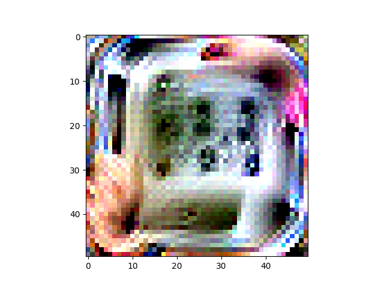
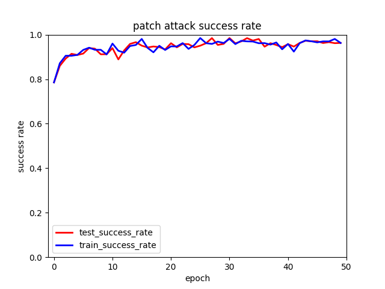

We generate the square patch on 2000 randomly selected pictures with 50 epochs and 5% noise. The shape of the patch is (50, 50, 3). And the generated patch is tested on 1000 rondomly selected pictures. The attack success rate on the testset of our best adversarial patch is 98.48% and it's generated at 30th epoch. 
Note that the accuracy of the ResNet50 on clean trainset and clean testset is 68.500% and 73.900%.
## best patch

## training line

